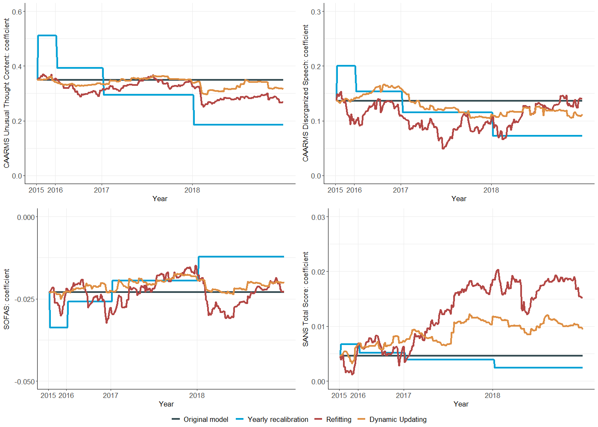

# Dynamic updating of psychosis prediction models in individuals at ultra high-risk of psychosis

## Introduction
Can model updating methods prevent critical biases in psychosis risk calculators caused by temporal changes? In this study with 784 individuals at ultra high-risk (UHR) of psychosis, Bayesian updating techniques optimally updated a psychosis risk calculator compared to no updating, recalibration, or continual refitting. Without updating, models were mis-calibrated across validation years leading to largely overestimated psychosis risk scores. Temporal biases of risk calculators can be corrected, yet there is a need for continual monitoring to avoid the potential for harm caused by suboptimal decisions on the basis of existing prediction models.

## Prerequisites

* R version >4
* [dma](https://github.com/hanase/dma)
* rms
* tidyverse

## Outcomes

## Please cite

Hartmann et al (2025): Dynamic updating of psychosis prediction models in individuals at ultra high-risk of psychosis. Accepted for publication in Biological Psychiatry: Cognitive Neuroscience and Neuroimaging

Jenkins DA, Martin GP, Sperrin M, Brown B, Kimani L, Grant S, Peek N (2024): Comparing Predictive Performance of Time Invariant and Time Variant Clinical Prediction Models in Cardiac Surgery. Stud Health Technol Inform 310: 1026–1030.
